# **Module 1: Enterprise Scale for SAP Automation Framework Deployment**

>**Note:** You may have to type commands in this document in manually or paste to another file editor rather than copy/paste into the VS Code terminal from this document. Each parameter for the automation commands will begin with a double dash ("--"). Ensure that there are no special characters when typing/pasting in the commands

## Scenario

For this workshop we will be using the Cloud Shell in the portal to
deploy the Control Plane infrastructure. Then, we will be using the
Deployer VM to deploy the remaining infrastructure and the SAP HANA
configurations. There is a customized branch based on the Automation
Framework that will enable us to follow this scenario. This is the
**sap-level-up** branch.

## Introduction

The SAP Automation Deployment Framework is an orchestration tool for
deploying, installing and maintaining SAP environments. It can deploy
the infrastructure as well as install the application. The automation
lab is currently based on SAP HANA 1909. Below we will describe the
general hierarchy and different phases of the deployment. There are
several workflows to deploying the deployment automation, we will be
focusing on one workflow for ease of deployment with a large audience:
**a SAP-HANA standalone environment deployed using bash. <u>Ensure that
you execute the pre-requisite tasks</u>**

**Environment Overview**

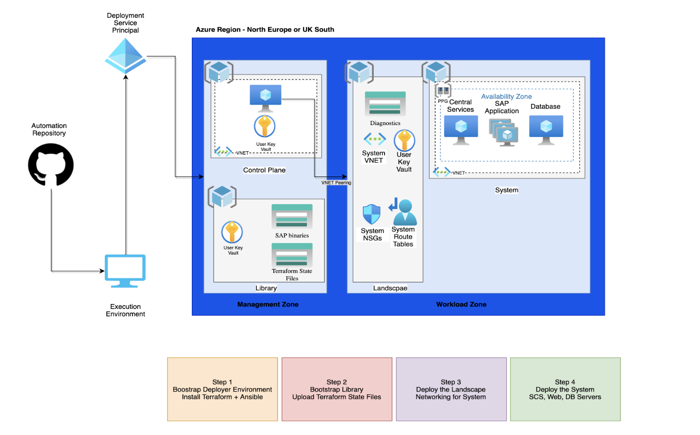

**<u>Management Zone:</u>** The management zone houses the
infrastructure from which other environments will be deployed. Once the
management zone is deployed, it rarely needs to be redeployed, if ever.

**Deployer**

This deployment houses the infrastructure that will be needed to deploy
the rest of the infrastructure. It contains the deployer VM, network
infrastructure on which it lives and a key vault with secrets. Deployer
VM has Ansible and Terraform installed and is used to deploy the
remaining Landscape Zone and Workload Zone. A copy of the repository
that you used to deploy the Control Plane will be transferred to the
Deployer machine

**Library**

This deployment consists of the storage accounts for the Terraform state
files as well as the storage account for the SAP bits that will be
deployed to the System deployment.

**<u>Workload Zone</u>**: The Workload Zone contains the VMs for the SAP
application, including Web VMs, Central Services VMs, and the HANA
database machines. It also deploys the requisite infrastructure such as
the virtual network and the NSGs/Route Table.

**Landscape**

The Landscape contains the Networking for the SAP VMs, including Route
Tables, NSGs, and Virtual Network. The Landscape provides the
opportunity to divide deployments into different environments (Dev,
Test, Prod)

**System**

The system deployment consists of the virtual machines that will be
running the SAP application, including the web, app and database tiers.

| **Step** | **Action Plan**                                            | **Installation time** | **Time required for each step** |
|----------|------------------------------------------------------------|-----------------------|---------------------------------|
| 1        | Introduction and Session Walkthrough                       | NA                    | 10 min                          |
| 2        | Repository Overview                                        | NA                    | 5 min                           |
| 3        | Management Zone Deployment Overview (Deployer and Library) | 15-30 mins            | Preconfigured                   |
| 4        | Deploy the Workload Zone Walkthrough                       | 15-30 mins            |                                 |
| 5        | System Deployment                                          |  20-30 mins           |                                 |
| 6        | Break                                                      | 10 mins               |                                 |
| 7        | Talk about naming conventions                              | 20 mins               |                                 |
| 8        | SAP Installation                                           | 60 mins               |                                 |
| 9        | SAP Installation Cleanup                                   | 30 mins               |                                 |
|          |                                                            |                       |                                 |
|          |                                                            |                       |                                 |
|          |                                                            |                       |                                 |
|          |                                                            |                       |                                 |
|          |                                                            |                       |                                 |
|          |                                                            |                       |                                 |

**<u>Tasks 0 – 5 are PRE-REQUISITES to the Level Up</u>**

## Task 0: Repository, Downloads and Tooling

The GitHub repository can be found at the link below:

[Azure/sap-hana: Tools to create, monitor and maintain SAP landscapes in
Azure. (github.com)](https://github.com/Azure/sap-hana)’’’

Be sure to change the branch from master to **sap-level-up**:


We strongly recommend familiarizing yourself with the documentation
ahead of time to get an idea of how the SAP Automation Framework works.

You will need an SSH client in order to connect to the Deployer. We
recommend using
[**Putty**](https://www.chiark.greenend.org.uk/~sgtatham/putty/latest.html).
Use any SSH client that you feel comfortable with.

### Review the Azure Subscription Quota

As part of SAP Level Up, please ensure Microsoft Subscription has a
sufficient Quota of a minimum of 50 for compute sku DDSV4 & ESDV4 in the
assigned region.

**Let us begin the pre-requisite portion of the lab**

## **Task 1: Cloud Shell Setup**

- Go to **shell.cloud.com
    (<https://ms.portal.azure.com/#cloudshell/>)**

<!-- -->

- Run the following commands:

    ```az login```

    Follow the instructions displayed in order to authenticate. You should see the following screen upon successful authentication:


    ```shell
    az account set -s <SubscriptionID>
    ```

    View your subscriptions and get the subscription ID of the one you wish to use

    ```az account list -o table | grep True```

    ```shell
    mkdir Azure_SAP_Automated_Deployment
    cd Azure_SAP_Automated_Deployment
    git clone https://github.com/Azure/sap-hana.git
    cd sap-hana
    git checkout sap-level-up
    ```

    *Only work from the sap-level-up branch during the lab*

    

    ```cd util```

    Execute the command ```./check_workstation.sh```

    

  - The below versions are supported for the automation:
    - az = 2.28.0
    - terraform = 1.0.8
    - ansible = 2.10.2
    - jq = 1.5

    

    If you do not have at least version 1.0.8 for Terraform, please upgrade using the instructions [here](https://www.terraform.io/upgrade-guides/0-12.html)

## **Task 2: SPN Creation**

**Per Microsoft security guidelines, there will be no screenshots of
this task. Ask your proctor for help if you need assistance with the
following.**

- The Automation Framework requires the creation of an SPN. Please create one in the Cloud Shell using the following commands:

> **When choosing the name for your service principal, ensure that the
> name is <u>unique within your Azure tenant</u>**

```shell
-az ad sp create-for-rbac --role="Contributor"
--scopes="/subscriptions/\<Your subscription ID>"
--name="LevelUP-SAP-Deployment-\<Your alias>"
```

- After running this command, you will have output that is populated with actual values, like the following:

    ```json
    {
    "appId": "AppID",
    "displayName": "[Yourname]-Deployment-Account",
    "name": "AppID",
    "password": "<AppID Secret>",
    "tenant": "<Tenant ID>"
    }
    ```

- Copy the details to a notepad/similar as these details are key for the next steps. The pertinent fields are**:**
  - appId
  - password
  - Tenant

    *For your reference, here is the mapping between the output above and the parameters that you will need to populate later for the automation commands:*

    | **Parameter Input name** | **Output from above** |
    |--------------------------|-----------------------|
    | **spn_id**               | **“appId"**           |
    | **spn_secret**           | **"password":**       |
    | **tenant_id**            | **"tenant":**         |

- Finally, assign the “User Access Administrator” role to the SPN by running the following command:

    ```az role assignment create --assignee <appId> --role "User Access Administrator"```

## **Task 3: View Configuration Files and Collect Parameter Values**

- In the Cloud Shell, type the following commands:

    ```shell
        cd \~/Azure_SAP_Automated_Deployment**
        cp -Rp ./sap-hana/deploy/samples/WORKSPACES ./
    ```

    Please run ```ls``` and verify that WORKSPACES folder is available

    

    ```code . ```
    *Note:* There is a period at the end of the command: "code + space + ."

    

- Expand the **WORKSPACES** directory – you will see 5 sub folders:
    **DEPLOYER**, **LANDSCAPE**, **LIBRARY**, **SYSTEM** and **BOMS.**
    Expand each of these folders to find regional deployment
    configuration files similar to the below screenshot:

> 
>
> **Note: Only use the regional folder associated with your group. Do
> not use the West Europe (WEEU) folders as this is a busy customer
> region.**

- We have mapped different Azure region with 4-character code (Upper
    Case) and subsequent folders inside WORKSPACES folder has been
    created to represent deployment in those respective regions. Please
    find the below table for reference

| Region Name        | Region Code |
|--------------------|-------------|
| Australia East     | AUEA        |
| Canada Central     | CACE        |
| Central US         | CEUS        |
| East US            | EAUS        |
| North Europe       | NOEU        |
| South Africa North | SANO        |
| Southeast Asia     | SOEA        |
| UK South           | UKSO        |
| West Europe        | WEEU        |
| West US 2          | WES2        |

- If you drill down into each regional sub folder, you will see the
    Terraform variable files that are used for configuration. Snippet of
    the **DEPLOYER** Terraform variable file below.
    

- There are no edits necessary for the Terraform variable files – this
    is informational only so that you can view them and know where to
    make edits for future deployments.

## **Task 4: Export variables and run the prepare_region.sh script**

  - We will use the **prepare_region** script in order to deploy the
        Deployer and Library. These deployment pieces make up the
        “Automation Region”

> **az login**
>
> **Follow the instructions in the Cloud Shell for authenticating**
> **with your normal account, not the service principal you** **created
> earlier**
>
> **az account set –s \<subscription name or ID>**
>
> **export
> DEPLOYMENT_REPO_PATH=\~/Azure_SAP_Automated_Deployment/sap-hana/**
>
> **export ARM_SUBSCRIPTION_ID=\<YOUR SUBSCRIPTION ID>**
>
> 
>
> Empty output means it has executed as expected. Proceed to next steps

- Navigate to the **WORKSPACES** folder and deploy the Automation
    Region and run the following commands:

> **cd \~/Azure_SAP_Automated_Deployment/WORKSPACES**
>
> **${DEPLOYMENT_REPO_PATH}deploy/scripts/prepare_region.sh
> --deployer_parameter_file
> DEPLOYER/MGMT-\<Region>-DEP00-INFRASTRUCTURE/MGMT-\<Region>-DEP00-INFRASTRUCTURE.tfvars.tfvars
> --library_parameter_file
> LIBRARY/MGMT-\<Region>-SAP_LIBRARY/MGMT-\<Region>-SAP_LIBRARY.tfvars
> --subscription \<subscription ID> --spn_id \<App ID> --spn_secret
> \<SPN password> --tenant_id \<tenant ID> --auto-approve**
>
> **If you get the following error for the Deployer module deployment,
> ensure that you have navigated to the WORKSPACES directory:**
>
> 
>
> The Automation will run the Terraform Initialize and Plan operations.
>
> 
>
> This deployer may run between 15 and 20 min.
>
> You should see the progress of the deployment such as below:
>
> 
>
> The deployment will go through cycles of deploying the infrastructure,
> refreshing the state, and uploading the Terraform state files to the
> Library storage account
>
> **If you get the following error for the Deployer deployment, this is
> transient, and you can simply rerun the exact same command:**
>
> 
>
> **If you run into authentication issues directly after running the
> prepare_region script, please execute:**
>
> **az logout**
>
> **az login**
>
> **Also please ensure you are using the correct subscription, the one
> where you created the SPN. If you execute az logout, then you must
> export your session variables again.**

- When the entire deployment is complete and you see that your
    Terminal has stopped, go to the Azure portal and go to the Deployer
    Infrastructure **(MGMT-\[region\]-DEP00-INFRASTRUCTURE)** resource
    group. You should see the following resource types

> Deployer Infrastructure resource group:
>
> 
>
> LIBRARY resource group
>
> 
>
> Inside the state file storage account and inside the tfstate
> container, you should see the Deployer and Library state files:
>
> 

- Collect the following information in a text editor of your choice.
    We will use these details as parameter inputs for the remainder of
    the commands in Module One:

  - The name of the Terraform state file storage account in the
        Library resource group. Deployer resource group -> state storage
        account > containers -> tfstate -> Copy the **name** of the
        Deployer state file

> 
>
> 

- The private ssh secret for the Deployer VM.

Deployer Resource Group -> **MGMT\<region>DEP00userXXX -> \<Key Vault>
->** Click on Secret -> Click on current version -> Copy the secret

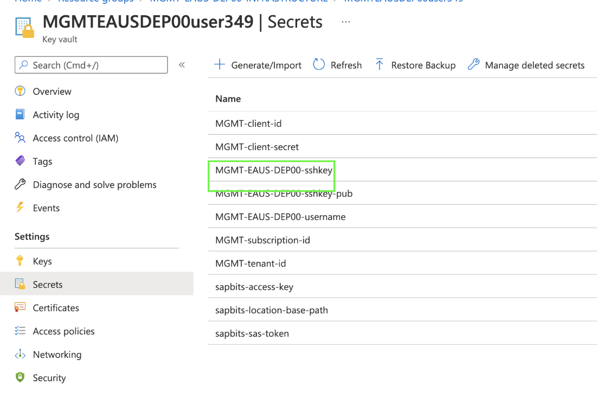

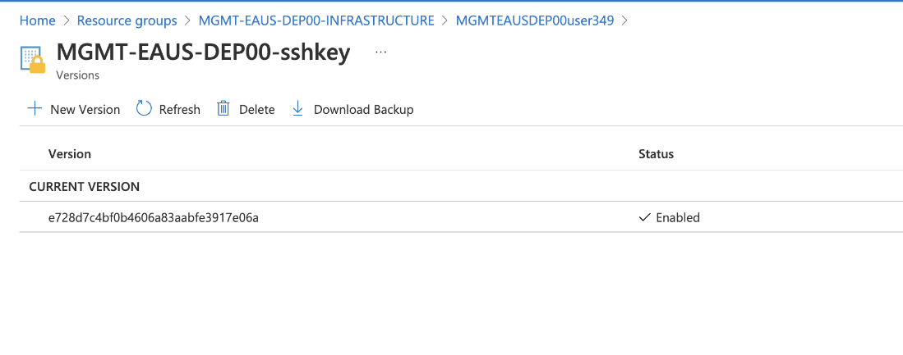


Open Notepad or a similar editor and paste the contents of the secret
value. We will use it in the next step.

- The name of the Deployer resource group key vault


- The Public IP address of the Deployer VM

> Deployer resource group -> Deployer VM -> copy Public IP Address
>
> 

## **Task 5: Connect to the Deployer - The rest of Module One will be completed on the Deployer VM**

**<u>Ensure that you can connect to your deployer machine as we will be
deploying the rest of the infrastructure from that machine. If you need
assistance, please reach out in the Level Up teams channel</u>**

- Open Notepad or and editor of your choice and copy the ssh key
    collected in the previous task. Copy the file to “C:\\Users\\\[your
    alias\]\\.ssh. Name the file “deployer_ssh” and save as the type
    “All Files”

> 
>
> **Note: File name should not have .txt extension**
>
> 

- **Open PuttyGen (do this by opening a command window and typing
    *puttygen.exe*), then click on “Load”**

> 

- **Load the SSH
    key**

- Save the private the key with name **\<Region>-deployer_ssh**

> 

- **Connecting the Deployer VM using PuTTY:**

<!-- -->

- Open Putty

- Host Name: azureadm@\<Deployer Public IP Address>

- Connection Name in Saved Sessions:
    > MGMT-**\<Region>**-SSHConnectivity”

> 
>
>  

- In the Navigation bar expand “SSH” --> Auth setting and add the path
    to the SSH key file browse to “C:\\Users\\\[your
    alias\]\\.ssh\\\<Region>-deployer.ppk” saved

> 

- Click on Open to open the connection to the Deployer:

> 
>
> 

**This completes the pre-requisite portion of the lab. Perform the
remaining tasks in Module One on the Deployer VM**

## **Task 7: Get the WORKSPACES folder and set the branch**

- Navigate to the **\~/Azure_SAP_Automated_Deployment** folder and
    remove the existing WORKSPACES folder

> **rm –rf WORKSPACES**

- Navigate to the **\~/Azure_SAP_Automated_Deployment** **/sap-hana**
    folder and checkout the sap-level-up branch.

> **git checkout sap-level-up**
>
> 

- Go back to the root deployment folder and copy the repository
    WORKSPACES folder

**cd \~/Azure_SAP_Automated_Deployment**

> **cp -Rp ./sap-hana/deploy/samples/WORKSPACES ./**
>
> 

## **Task 6: BOM Details**

The Automation Framework gives you tools to download the SAP Bill Of
Materials (BOM). The downloaded files will be stored in the sapbits
storage account in the SAP Library. The idea is that the sap library
will act as the archive for all sap media requirements for a project.


The BOM itself mimics the SAP maintenance planner in that we have the
relevant product ids and the package download URLs. Once the BOM is
processed, during SAP system configuration the Deployer reads the BOM
and downloads files from the storage account to the SCS Server for
Installation.

A sample extract of a BOM file is provided below:


You will be able to utilize the following pre-staged storage accounts
(storage accounts with the SAP binaries) to fill in the
sap-parameters.yaml file. List of storage account details:

| Region             | Storage Account   | sapbits-location-base-path                                                                                                |
|--------------------|-------------------|---------------------------------------------------------------------------------------------------------------------------|
| Australia East     | mgmtaueasaplib515 | [<u>https://mgmtaueasaplib515.blob.core.windows.net/sapbits</u>](https://mgmtaueasaplib515.blob.core.windows.net/sapbits) |
| Canada Central     | mgmtcacesaplib3a0 | [<u>https://mgmtcacesaplib3a0.blob.core.windows.net/sapbits</u>](https://mgmtcacesaplib3a0.blob.core.windows.net/sapbits) |
| Central US         | mgmtceussaplib542 | [<u>https://mgmtceussaplib542.blob.core.windows.net/sapbits</u>](https://mgmtceussaplib542.blob.core.windows.net/sapbits) |
| East US            | mgmteaussaplib87c | [<u>https://mgmteaussaplib87c.blob.core.windows.net/sapbits</u>](https://mgmteaussaplib87c.blob.core.windows.net/sapbits) |
| North Europe       | mgmtnoeusaplib83e | [<u>https://mgmtnoeusaplib83e.blob.core.windows.net/sapbits</u>](https://mgmtnoeusaplib83e.blob.core.windows.net/sapbits) |
| South Africa North | mgmtsanosaplib13c | [<u>https://mgmtsanosaplib13c.blob.core.windows.net/sapbits</u>](https://mgmtsanosaplib13c.blob.core.windows.net/sapbits) |
| SouthEast Asia     | mgmtsoeasaplib0c5 | [<u>https://mgmtsoeasaplib0c5.blob.core.windows.net/sapbits</u>](https://mgmtsoeasaplib0c5.blob.core.windows.net/sapbits) |
| UK South           | mgmtuksosaplib0b0 | [<u>https://mgmtuksosaplib0b0.blob.core.windows.net/sapbits</u>](https://mgmtuksosaplib0b0.blob.core.windows.net/sapbits) |
| West Europe        | mgmtweeusaplib783 | [<u>https://mgmtweeusaplib783.blob.core.windows.net/sapbits</u>](https://mgmtweeusaplib783.blob.core.windows.net/sapbits) |
| West US2           | mgmtwus2saplibb32 | [<u>https://mgmtwus2saplibb32.blob.core.windows.net/sapbits</u>](https://mgmtwus2saplibb32.blob.core.windows.net/sapbits) |

Navigate to the \~/**Azure_SAP_Automated_Deployment/WORKSPACES/BOMS**
folder and do the following:

> Run **nano sap-parameters.yaml**
>
> 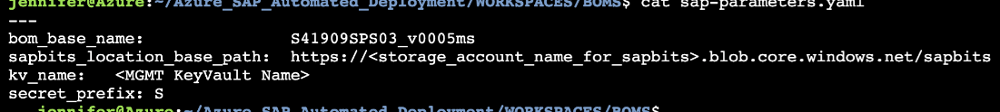
>
> Change **\<storage_account_name \_for_sapbit>** to the name of the
> storage account for your region from the table above
>
> Change **\<MGMT KeyVault Name>** to the name of the Deployer resource
> group key vault
>
> On your keyboard enter: **CTRL + X \>** press “**Y” \>** press
> **Enter** to save the file
>
> Your file should look similar to this:
>
> 
>
> We will provide the SAS token during the Level Up session. We will be
> executing the following commands:
>
> **sapbits_base_path=\<sapbits_location_base_path from sap-parameters
> ile>**
>
> **sas=\<to be given in Level Up>**
>
> **az keyvault secret set --name "sapbits-location-base-path"
> --vault-name "Your_MGMT_KeyVault_Name" --value "$sapbits_base_path";**
>
> **az keyvault secret set --name "sapbits-sas-token" --vault-name
> "Your_MGMT_KeyVault_Name" --value "$sas";**

## **Task 8: Deploy the Workload Zone**

- On the Deployer VM, navigate directly to the regional Workload zone
    folder:

> **cd
> \~/Azure_SAP_Automated_Deployment/WORKSPACES/LANDSCAPE/DEV-\<region>-SAP01-INFRASTRUCTURE**

- Run the following command. Replace all parameters with the
    appropariate details that you have collected in previous Tasks:

> **${DEPLOYMENT_REPO_PATH}/deploy/scripts/install_workloadzone.sh
> --parameterfile ./DEV-WEEU-SAP01-INFRASTRUCTURE.tfvars
> --deployer_environment MGMT --subscription \<subscription ID> --spn_id
> \<SPN App ID> --spn_secret \<SPN Secret> --tenant_id \<Tenant ID>
> --state_subscription \<subscription ID> --vault \<DEPLOYER resource
> group key vault> --storageaccountname \<state file storage account
> name> --deployer_tfstate_key \<name of the deployer state file>
> --auto-approve**


- You should start to see the landscape module deploy:


Similarly, once the Landscape is complete, you can deploy the system
resources using the following commands:

- **cd
    \~/Azure_SAP_Automated_Deployment/WORKSPACES/SYSTEM/DEV-\<region>-SAP01-X00**

<!-- -->

- **${DEPLOYMENT_REPO_PATH}/deploy/scripts/installer.sh
    --parameterfile DEV-\<region>-SAP01-X00.tfvars --type sap_system
    --auto-approve**

- You should have two more resource groups

<!-- -->

- Landscape Resource Group example:


- System Resource Group (Abridged):  
    

## **Task 9: Naming Conventions**

- Please see the information on changing the naming convention
    [here](https://github.com/jhajduk-microsoft/sap-hana/blob/master/documentation/SAP_Automation_on_Azure/Process_Documentation/Changing_the_naming_convention.md)

- Please see the video on naming conventions
    [here](https://microsoft.sharepoint.com/:v:/t/NorthStarPlaybookWorkshop/EfdM1eCJga1OkJXXB5d6lDQBzNzXiU7BZkoQjC6bp325Wg)

Give the break for 10 min and talk about naming convention

## **Task 10: SAP Installation**

For a standalone SAP S/4HANA system we have 8 playbooks to execute in
sequence.

> OS Config
>
> SAP Specific OS Config
>
> BoM processing
>
> HANA DB Install
>
> SCS Install
>
> DB Load
>
> PAS Install
>
> APP Install (Optional)

Execute the **${DEPLOYMENT_REPO_PATH}/deploy/ansible/test_menu.sh**
script

#### **10-1: OS Config**


At the end you will see the screen like below


#### **10-2: SAP** Specific OS config


#### **10-3: BoM** Processing


#### **10-4: HANA DB Install**

Before you install HANA please check the secret
DEV-WEEU-SAP-\<SID>-sap-password inside workload keyvault have the value
not starting with a digit


So, if the value looks like above i.e starting with a number, we need to
change it.

The password of user DBUser may only consist of alphanumeric characters
and the special characters #, $, @ and \_. The first character must not
be a digit or an underscore

So it will look like below


#### **10-5: SCS Install**


#### **10-6: DB Load**


#### **10-7: PAS** Install


#### **10-8: APP Install**


Congratulations! You have reached the end of Module One and have
deployed a stand-alone HANA system.

## **Task 11: Clean-up**

You may perform this task outside of the lab but please be sure to do so
as the **<u>infrastructure can be quite expensive so do not delay!</u>**
You may find that you lose any credits you have very quickly. Follow the
below steps in sequence to remove the entire SAP infrastructure you have
deployed earlier:

Remove SAP Infra Resources -> Remove Workload Zone -> Remove Control
Plane

Please also note that

1. Removal of SAP infra-Resources

2. Removal of workload Zone

Should be executed from the deployer VM, whereas

3. Removal of control Plane

Should be executed from cloud shell where you have deployed the control
plane earlier

So, let’s start cleaning up Azure resources (for 1 and 2 as mentioned
above) from your Deployer VM

Before you start executing remover script make sure you have logged in
to your Azure account by executing the below command

az login

Authenticate through
<https://login.microsoftonline.com/common/oauth2/authorize>

and enter your device code you see in the bash shell

If you notice multiple subscriptions, please set the specific
subscription you are working with by executing the below command

az account set --subscription \<your subscription ID>

**Removal of SAP infra resources**

- Navigate to the DEV-XXXX-SAP01-X00 subfolder inside SYSTEM folder
    and execute the below command from there

> **$DEPLOYMENT_REPO_PATH/deploy/scripts/remover.sh --parameterfile
> DEV-\<region>-SAP01-X00.json --type sap_system**
>
> Proceed with **‘Yes’**

**Removal of SAP workload resources**

- Navigate to the DEV-XXXX-SAP01-INFRASTRUCTURE sub-folder inside
    LANDSCAPE folder and execute the below command from there

> **$DEPLOYMENT_REPO_PATH/deploy/scripts/remover.sh --parameterfile**
> **DEV-\<region>-SAP01-INFRASTRUCTURE.tfvars --type sap_landscape**
>
> Proceed with **‘Yes’**

**Removal of Control Plane**

- Now go to <https://shell.azure.com> (for 3)

- Navigate to the WORKSPACES folder inside
    \~/Azure_SAP_Automation_Deployment folder

- Export the below two environment variables (It get lost after
    session time out)

> **export
> DEPLOYMENT_REPO_PATH=\~/Azure_SAP_Automated_Deployment/sap-hana**
>
> **export ARM_SUBSCRIPTION_ID=\<Your Subscription ID>**

- and run the below command from WORKSPACES folder:

> **$DEPLOYMENT_REPO_PATH/deploy/scripts/remove_region.sh
> --deployer_parameter_file DEPLOYER/MGMT-\<region>-DEP00-**
> **INFRASTRUCTURE/MGMT-\<region>-DEP00-INFRASTRUCTURE.tfvars –**
> **library_parameter_file LIBRARY/MGMT-\<region>-SAP_LIBRARY/
> MGMT-\<region>-SAP_LIBRARY.tfvars**
>
> Proceed with **‘Yes’**
>
> Congratulation! You have cleaned up all resources.

**Module 2: SAP + Data & AI**

As explained in the General Hierarchy section, Application Group is a
logical grouping of applications installed on session hosts in the host
pool. They are of two types:

- RemoteApp

- Desktop

## **Scenario: Data Extraction à Data Lake à Modelling technique \[CDMs\] à Analytics\[Power BI\]**

@sanjeev to add visual for the whole flow. This will provide an overview
to audience how multiple components are interacting with each other
end-to-end.

## Introduction

### Agenda

| **S.No** | **Action Plan**                             | **Installation time** | **Time required for each step** |
|----------|---------------------------------------------|-----------------------|---------------------------------|
| 1        | Create Synpase Analytics                    | NA                    | 10 mins                         |
| 2        | Add Linked Services into Synapse Pipeline   | NA                    | 20 mins                         |
| 3        | Add Integration Dataset to Synapse Pipeline | NA                    | 20 mins                         |
| 4        | Run Data Extraction                         | NA                    | 10 mins                         |
| 5        | Add Parameters                              |  NA                   | 20 mins                         |
| 6        | Add Power BI visualization                  | NA                    | 20 mins                         |
| 7        | Q/A                                         |                       | 20 mins                         |
|          |                                             | Total                 | 120 mins                        |

## **Task 1: Pre-Requisites**

#### Deploy Synapse Analytics Workspace

- Go to htps://Portal.azure.com

  - 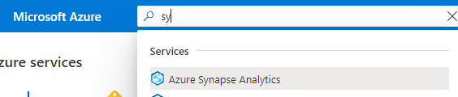

<!-- -->

- Ensure the the Synapse provider is registered in your subscription.
    Go to your subscriptions in the Azure Portal and go to Resource
    Providers, then search for Synapse and ensure it is a registered
    provider:

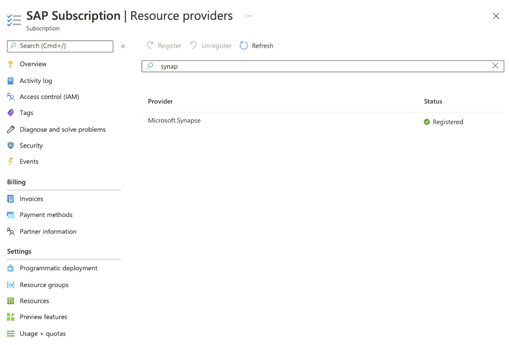

- Create Synapse Analytics

> 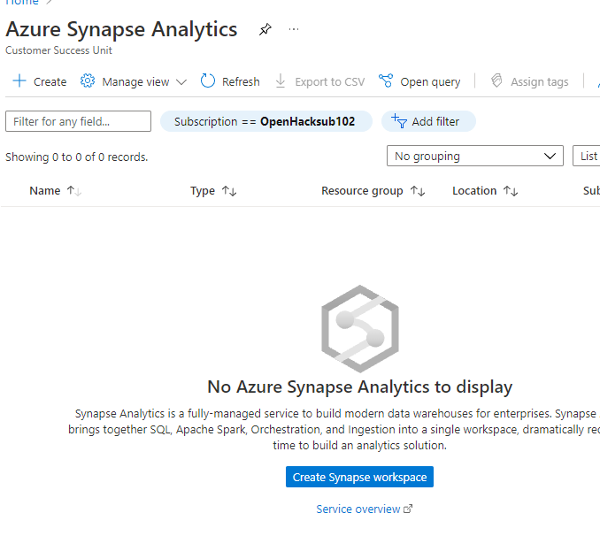

- Enter the details

  - 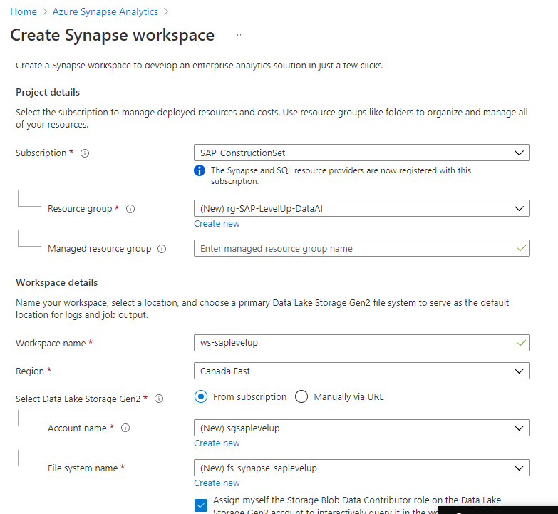

- Click on Review+ Create and then click on “Create”

  - While it is creating move forward with ste 2

#### Accessing SAP ES5 system

- Check access to SAP Sales Order oDATA service here
    <https://sapes5.sapdevcenter.com/sap/opu/odata4/sap/ze2e001/default/sap/ze2e001_salesorder/0001/SalesOrder?$top=3&sap-ds-debug=true>

- Register for ES5 demo system here
    <https://register.sapdevcenter.com/SUPSignForms/>

[New SAP Gateway Demo System available \| SAP
Blogs](https://blogs.sap.com/2017/12/05/new-sap-gateway-demo-system-available/)

PowerPoint to support the documentation

## **Task 2:** Prepare Synapse Pipelines resources

In this task you're going to prepare required object to extract data
from the SAP system over the OData protocol and save them on the data
lake.

#### Step 1: How to access synapse Studio

Portal.azure.com --> go to azure Synapse analytics --> Click on open
Synapse Studio

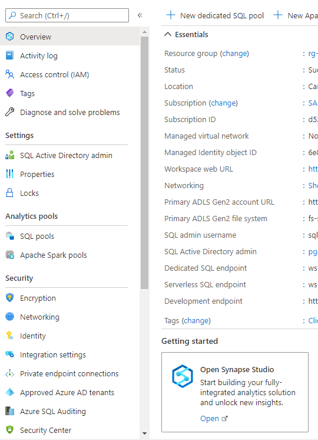

#### Step 2 – Create a Linked Service to connect to SAP system

1. On the left menu choose Manage icon

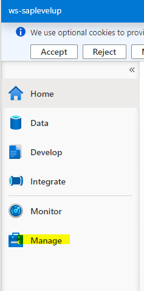

2. Select Linked Services from the menu

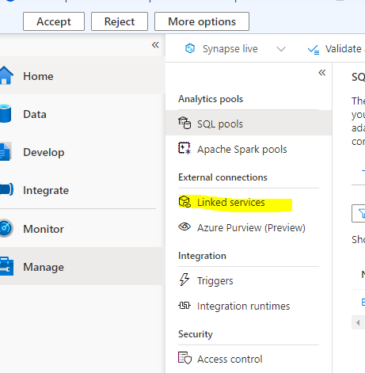

3. Click +New button

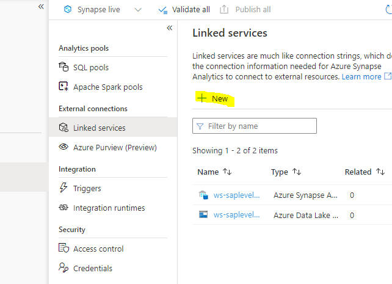

4. On the New Linked Service blade set the type to OData

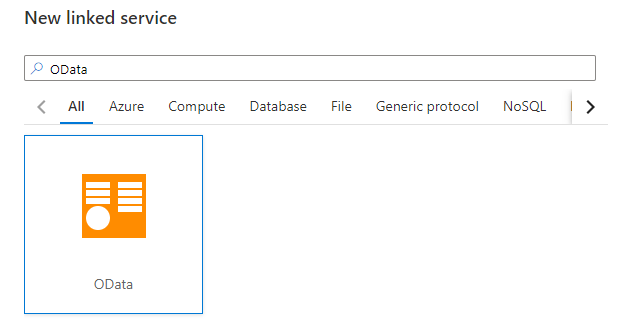

5. Fill the required fields to establish a connection:

Name: ES5_OData

Connect via Integration Runtime: AutoResolveIntegrationRuntime

Service URL:
<https://sapes5.sapdevcenter.com/sap/opu/odata/sap/SEPMRA_SO_MAN>

Authentication type: Basic authentication

Username:

Password

Auth headers:

Property name: sap-client

Value: 002

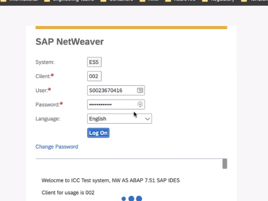

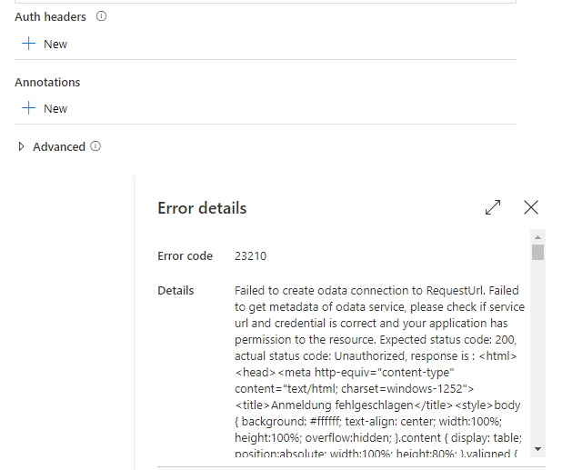

6. Test the connection. You should receive message saying the
    Connection was Successful.

7. Click Apply to save your settings.

#### STEP 3 – Create Integration Dataset that represents the OData

1. On the left menu choose Data icon

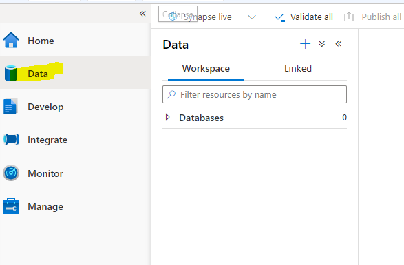

2. Switch the view from Workspace to Linked

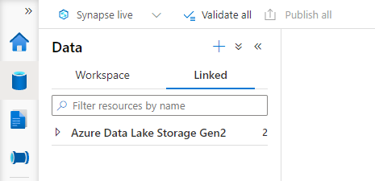

3. Click the + button and create a new Integration Dataset

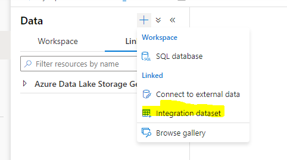

4. On the New Integration Dataset blade set the type to OData

5. Provide the name of the Integration Dataset and link it to the
    ES5_OData linked service. Path: SEPMRA_C\_SalesOrderTP

    1. This collection has the details about Sales order

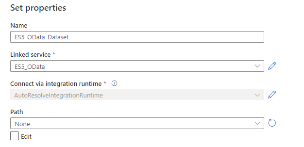

6. Click OK to save your settings

7. Error:
    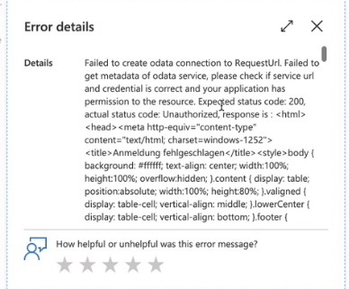

#### STEP 4 – Create Integration Dataset that represents the target Data Lake

As part of Synapse you have deployed a Data Lake storage which will be
the destination of the extracted data. In this step we will create a
dataset that represents the target storage.

1. On the left menu choose Data icon

2. Switch the view from Workspace to Linked


3. Click the + button and create a new Integration Dataset

4. On the New Integration Dataset blade set the type to Azure Data Lake
    Storage Gen2


5. Set the file format to Parquet

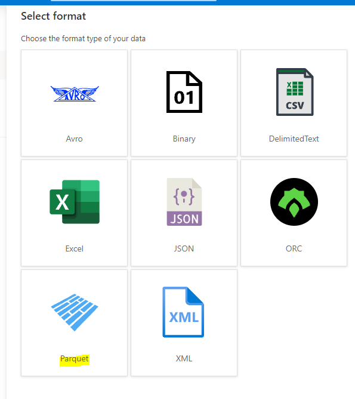

6. Provide the name of the Integration Dataset and link it to the Data
    Lake storage that was created as part of Synapse

Click on the Browse

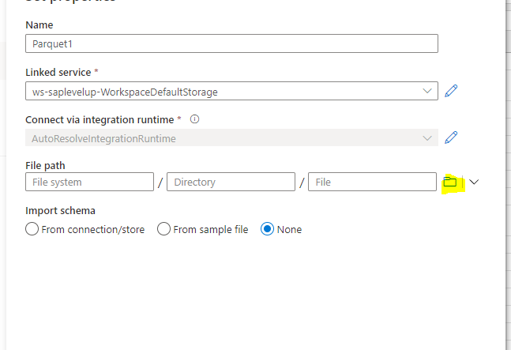

7. Click OK to save your settings

8. 

#### STEP 5 – Publish and save your settings

To deploy changes we've done in this task we have to Publish them. Click
the Publish All button from the top menu.

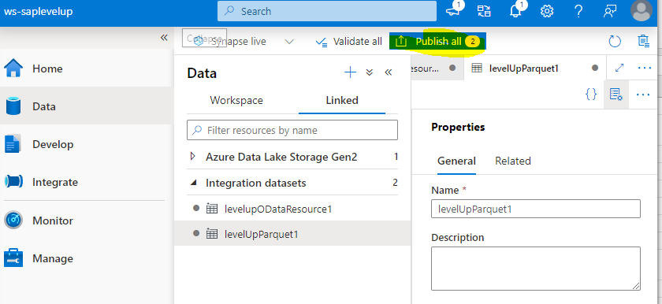

## **Task 3: Create Synapse Pipeline**

In the previous task we created all required resources to establish the
connection with the source system and target storage. In this task we'll
use them to build the data extraction pipeline.

#### STEP 1 – Create a new pipeline

1. From the left menu choose Integrate icon

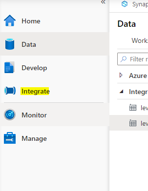

2. Click the + button and select Pipeline

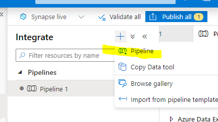

3. In the Properties window provide the name of the pipeline

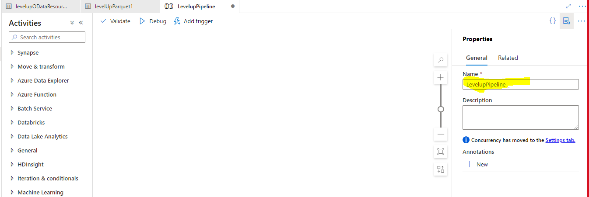

#### STEP 2 – Add Copy Data activity to extract Sales Orders

To extract Sales Orders data from the source SAP system you will use the
copy data activity.

1. On the Activities menu expand the Move and Transform group

2. Move the Copy Data activity to the pipeline

3. Provide the name of the Copy Data activity on the General tab

4. Move to the Source tab and choose the source dataset that represents
    the OData connection to the ES5 system

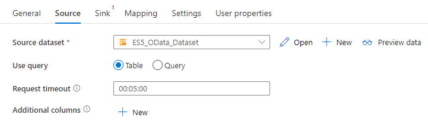

5. Move to the Sink tab and choose the target dataset that represents
    the Data Lake storage:

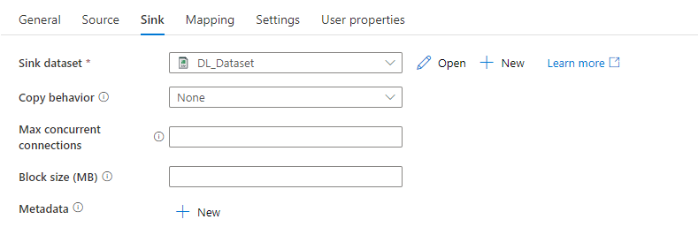

6. Click Publish All to save your settings

## **Task 4:** Run and monitor the data extraction process

In the last task we created a pipeline containing the Copy Data activity
to extract SAP data to the lake. Now we will run it to verify everything
went well.

#### STEP 1 – Check the processing status

1. Ensure you clicked the Publish All button and all settings are saved

2. On the Pipeline screen click the Add Trigger button and select Now
    to start the processing immediately

3. Confirm by clicking OK button. The extraction is now started.

4. On the left menu choose the Monitor button

5. In the Pipeline Runs view you should see the current status of the
    extraction process

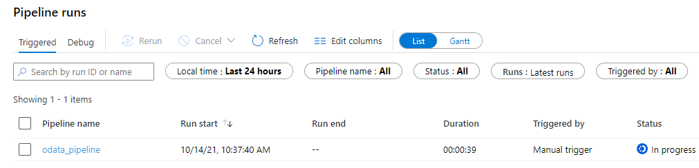

6. The extraction should take around one or two minutes. Use the
    Refresh button to see the current status of the extraction.

7. Once the Status is changed to Successful click on the pipeline name.
    In this view you can see the status of each activity contained in
    the pipeline.

8. In the Activity Runs section select the copy data activity and
    choose the Glasses icon to see the activity details.

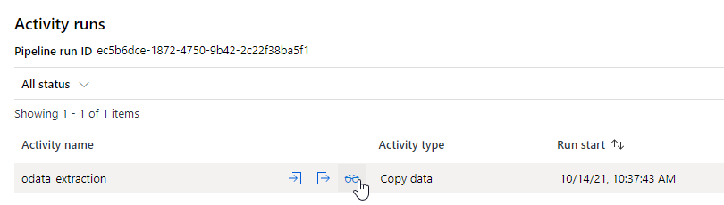

9. The details of the Copy Data contain useful information about the
    extraction process, like the total duration or number of rows
    processed.

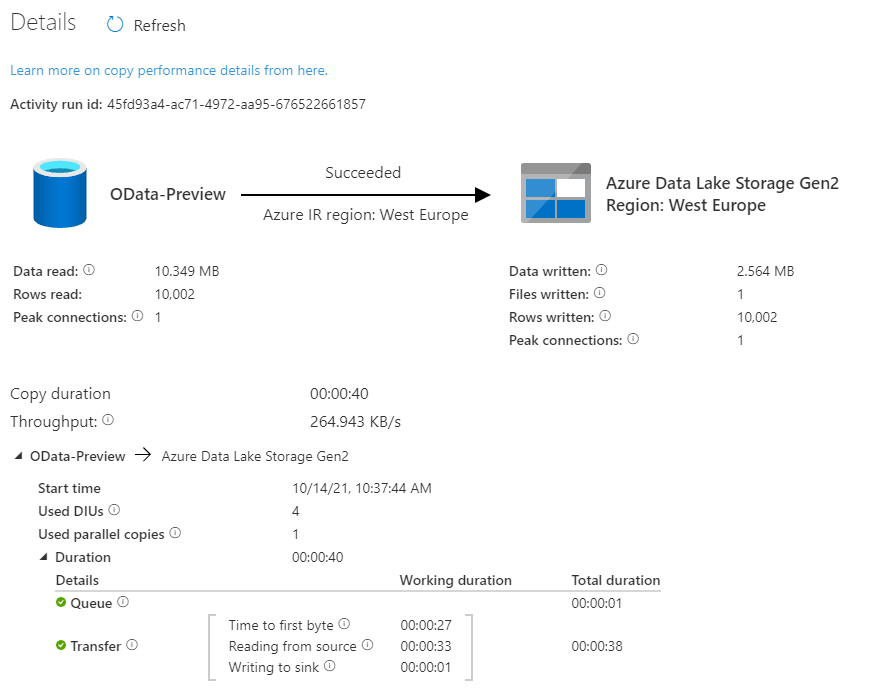

10. Click X button to close the Details window.

#### STEP 2 – Display extracted data in Synapse

Once we have all data available in the Data Lake you can use Synapse to
display the data.

1. Choose the Data icon from the left menu and switch to the Linked
    view

2. Expand the Azure Data Lake Storage Gen2 group

3. Choose the container with extracted data

4. You should see a list of files stored in the container

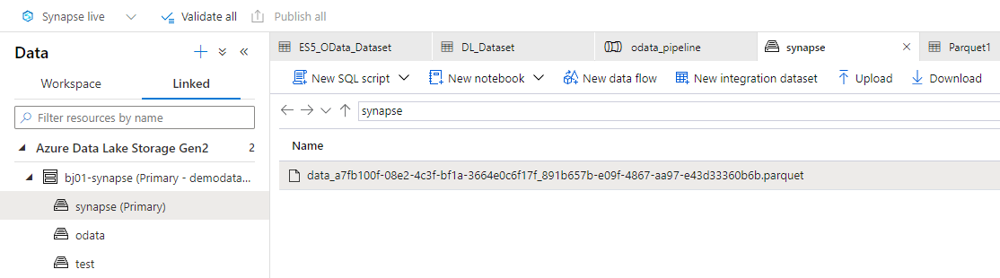

5. Click on the file using the right mouse button and choose New SQL
    Script – Select TOP 100 Rows

6. Click the Run icon

7. Extracted data are displayed on the screen

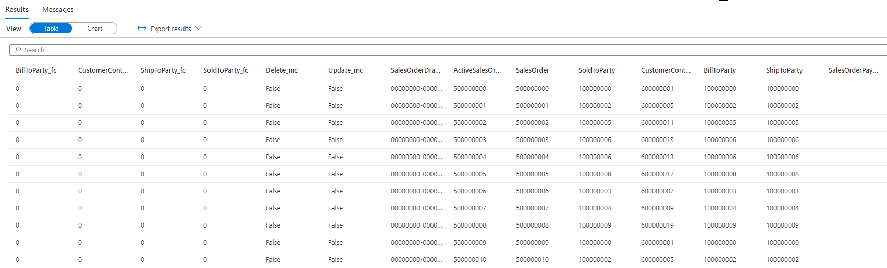

8. Delete the file containing data extraction – we will run the process
    again.

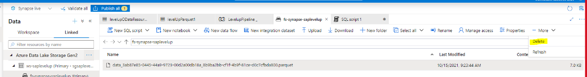

## **Task 5:** Use parameters to make the pipeline agile

So far all values in were hardcoded, which mean that if you'd like to
extract any additional data you have to create another Integration
Dataset. In this step we'll use parameters to customize the process.

#### STEP 1 – Define parameters for the OData dataset

1. Open the Data --> Integration Dataset that represent the source ES5
    system

2. Go to the Parameters tab and choose the +New button

3. Create a new parameter EntityName of type String. Leave the default
    value empty

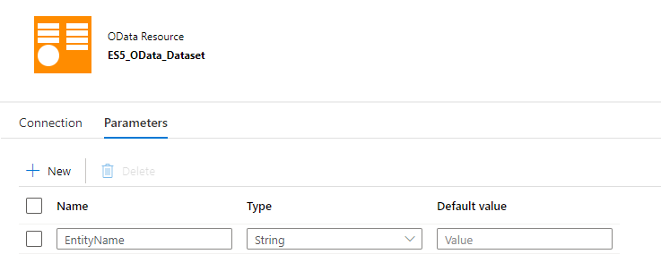

4. Go to the Connection tab and click the Edit checkbox under the Path
    input box

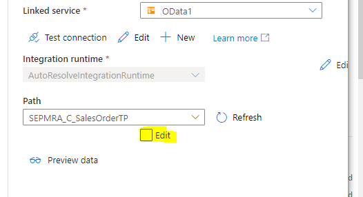

5. Clear the details from the Path text box . Choose Add Dynamic
    Content

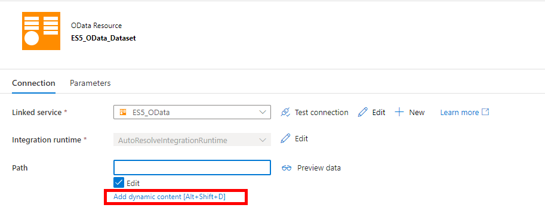


6. We will use Expressions to get the value of the EntityName to
    process. In the Add Dynamic Content view expand the Parameters group
    and choose EntityName:

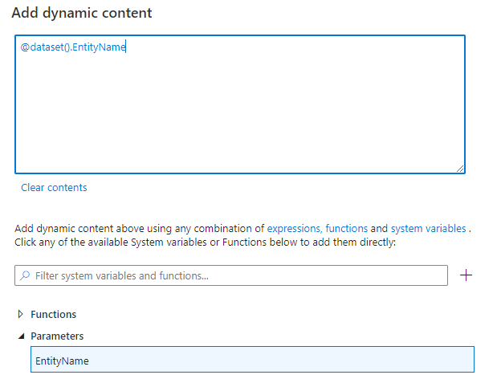

7. Click OK to save your settings.

#### STEP 2 – Define parameters for the Data Lake dataset

1. Open the Integration Dataset that represent the target data lake

2. Go to the Parameters tab and choose the +New button

3. Create a new parameter Path of type String. Leave the default value
    empty

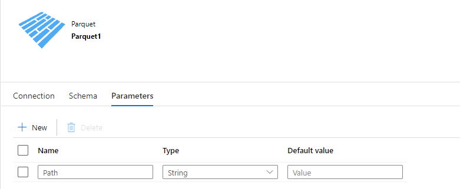

4. Go to the Connection tab

5. Click on the Directory field under File path and choose Add Dynamic
    Content

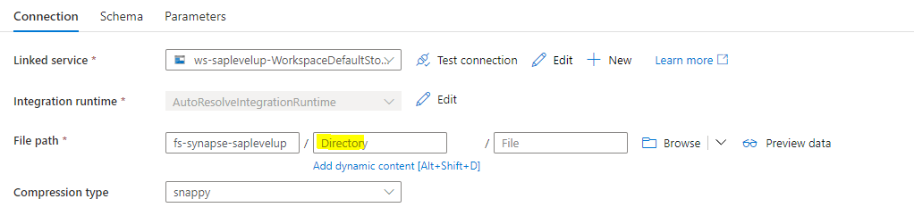

6. As in the previous step we will use the expression to reference the
    newly defined parameter.

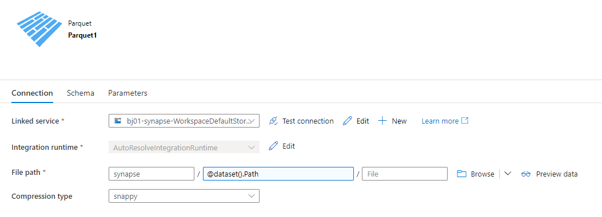

7. Click OK to save your settings.

#### STEP 3 – Modify existing Copy Data activity to pass parameters

1. Open the Synapse pipeline and select the Copy Data activity

2. In the Source tab you'll notice a new EntityName field. Enter a
    value SEPMRA_C\_SalesOrder

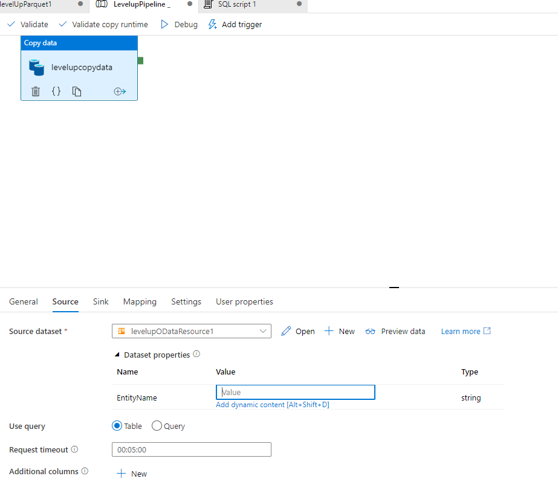

3. In the Sink tab there is a new Path field as well. Enter the
    SEPMRA_C\_SalesOrder value.

With above changes data extracted from the SEPMRA_C\_SalesOrder entity
of the OData service will land in the directory.

#### STEP 4 – Add a new Copy Data activity to extract customer information

1. Integrate --> Move & transform --> Copy Data

2. Add a new Copy Activity to the same pipeline and provide the name

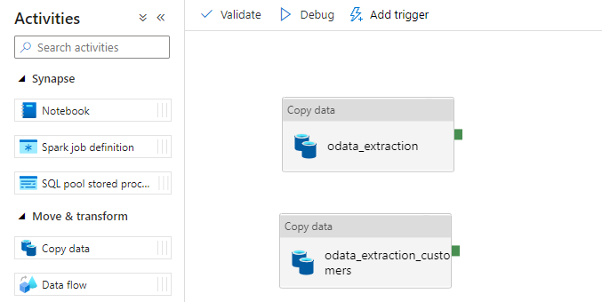

3. In the source tab reference the OData integration dataset. This time
    provide another Entity name: SEPMRA_C\_SalesOrderCustomer

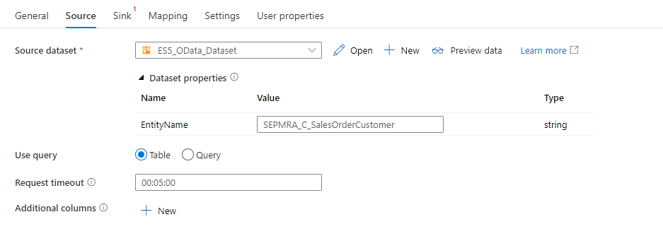

4. In the Sink tab reference the target Data Lake storage. Provide
    SEPMRA_C\_SalesOrderCustomer as the Path parameter.

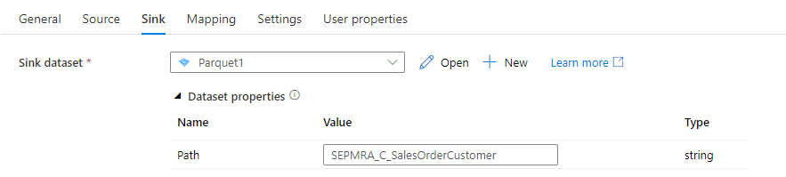

#### STEP 5 – Run and monitor the extraction

By using parameters we gained the possibility to customize integration
datasets during runtime, which allows us to reuse the resources to
process multiple objects. All extracted data from both entities will now
land in separate directories.

1. Ensure you clicked the Publish All button to save your settings.

2. Click Add Trigger -> Now button

3. Move to the Monitor view and wait until the extraction is completed

4. When you display the Activity Runs you see both activities were
    completed successfully:

> 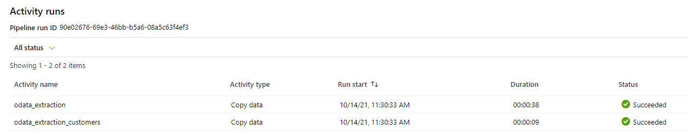

5. Go back to the Data view and display the content of the data lake.
    This time the target files are stored in subdirectories instead of
    the root folder.

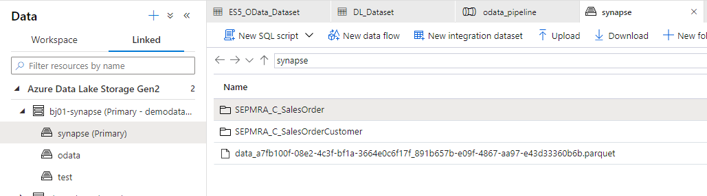

6. Ensure there are files in both directories. Display the content of
    both files.

## **Task 6: Create analytics dashboard in PowerBI**

Once we have all data stored in the Data Lake we can import them to
PowerBI and build visuals.

#### STEP 1 – Get Data Lake account key

1. Login to Azure Portal and go to storage accounts

2. Open the Storage Account that was created during Synapse Workspace
    deployment

3. Copy the Account Key which will be required to establish
    connectivity

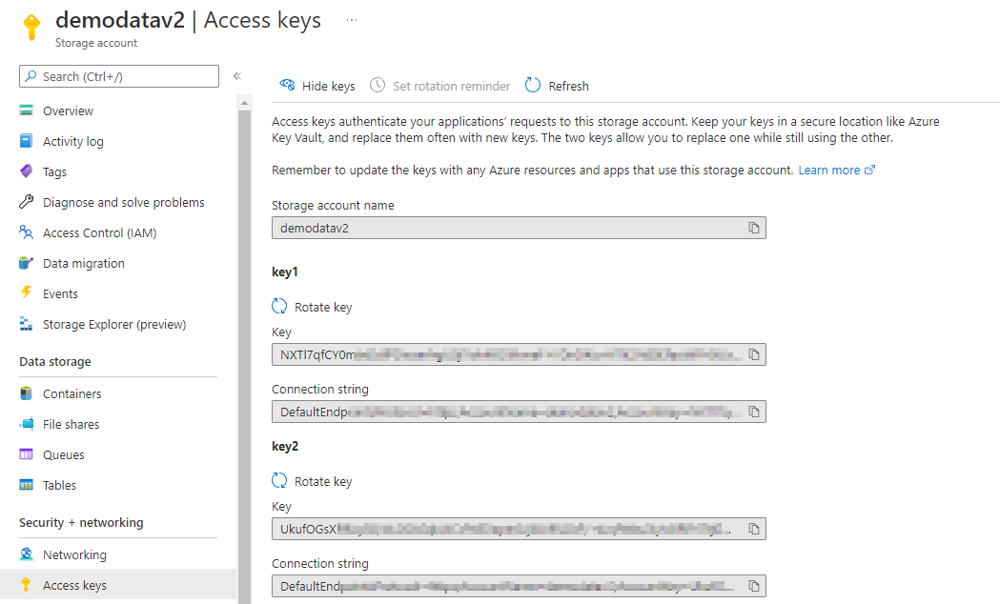

#### STEP 2 – Import your data to PowerBI

1. Open PowerBI Desktop

2. Click the Get Data button from the top menu

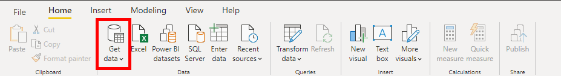

3. Choose the Data Lake as the source service and click connect

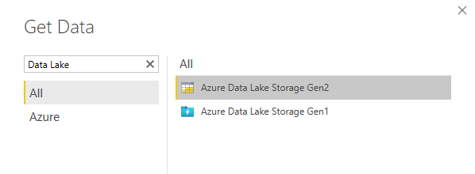

4. Provide the URL of the Data Lake service together with the container
    name.

5. Provide the previously copied Account Key and click Connect

6. Click Load to import both files with data extracts

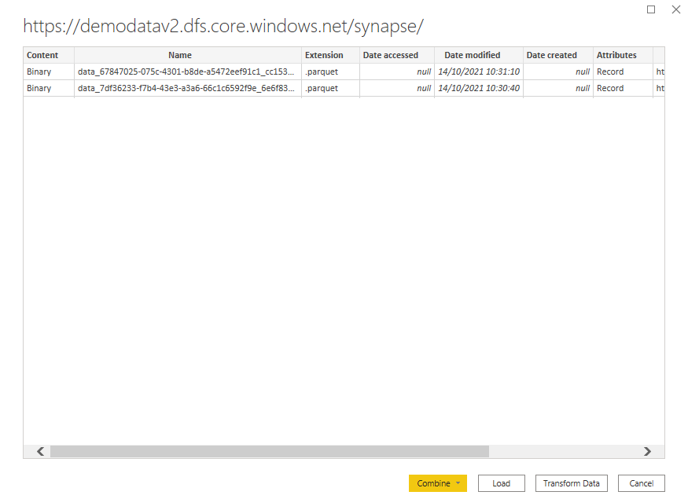

7.  

# **Summary**

Lessons learned; topics covered
